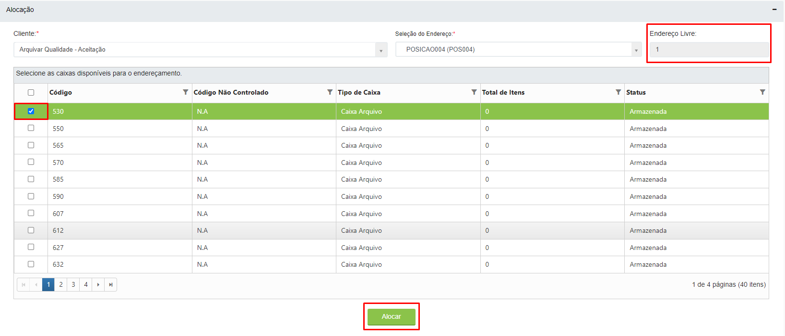
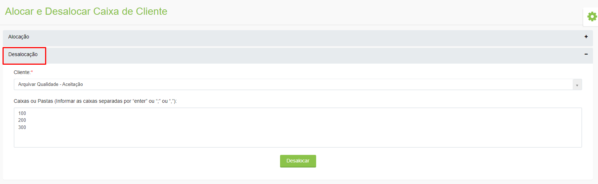

# 🟩 Alocar e Desalocar

Neste menu é definido o endereço para uma caixa ou pasta ser alocada e pode também ser retirado o endereço de uma caixa ou pasta.&#x20;

***

## Caixa do Cliente&#x20;

Para alocar uma caixa do cliente é preciso selecioná-lo no campo “Cliente” e selecionar o endereço dentro de sua estrutura onde a caixa ou pasta será alocada no campo “Seleção do Endereço”. &#x20;

<figure><figcaption>
Clique para ampliar a imagem.
</figcaption></figure>

Ao selecionar um dos locais da lista de endereços do cliente serão sinalizadas as posições que estão disponíveis e as que estão ocupadas. &#x20;

<figure><figcaption></figcaption></figure>

Para alocar as caixas basta selecionar aquelas que deseja alocar no endereço selecionado, respeitando a quantidade de disponibilidade exibida no campo “Endereço Livre” e clicar em “Alocar”. &#x20;

<figure><figcaption>
Clique para ampliar a imagem.
</figcaption></figure>

Para desalocar uma caixa ou pasta, no campo “Desalocação” informe os códigos das caixas ou pastas que deseja desalocar.&#x20;

<figure><figcaption>
Clique para ampliar a imagem.
</figcaption></figure>
