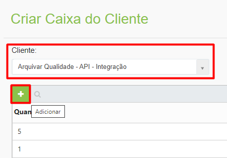
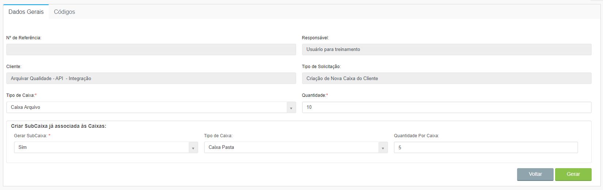
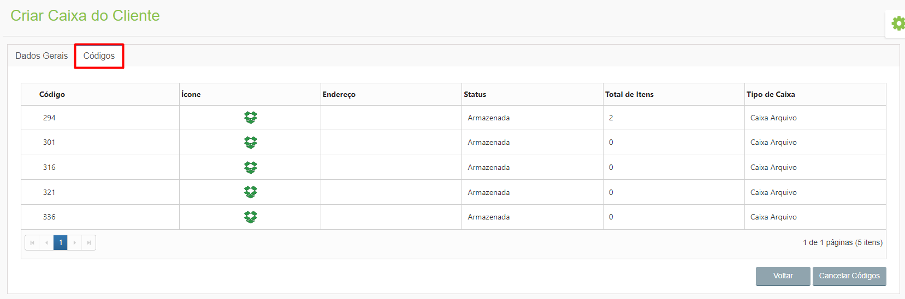

# 🟩 Criar

Depois de criar um tipo de caixa ou pasta e de vinculá-lo a um cliente, é preciso criar as caixas desse cliente, neste menu. &#x20;

***

## Caixa do Cliente &#x20;

No menu Caixa do Cliente são criadas caixas controladas pelo próprio cliente. Para criar uma caixa do cliente, selecione-o no campo “Cliente” e clique no ícone “Adicionar”. &#x20;

<figure><figcaption></figcaption></figure>

Os campos “Nº de Referência”, “Responsável”, “Cliente” e “Tipo de Solicitação” serão preenchidos automaticamente. Selecione o “Tipo de Caixa” e a quantidade de caixas ou pastas que estão sendo criadas. Informe também se deseja criar subcaixas associadas à caixa que está sendo criada. Para finalizar, clique em “Gerar”.&#x20;

<figure><figcaption>
Clique para ampliar a imagem.
</figcaption></figure>

### Aba Códigos&#x20;

Depois de gerar as caixas, na aba “Códigos” será possível visualizar os códigos, ícone representativo, status, total de itens armazenados e tipo de cada uma das caixas geradas. &#x20;

Para desfazer a criação das caixas, clique em “Cancelar Códigos”. Será feito o cancelamento de todas as caixas criadas na requisição. &#x20;


<mark style="color:orange;">**A cobrança do ArqDOC é feita por número de caixas, portanto, é imprescindível que a criação de caixas seja feita com atenção. A funcionalidade “Cancelar Códigos” foi desenvolvida para que seja possível cancelar uma criação de caixas indevida e essa cobrança não seja feita para o cliente.**</mark>


<figure><figcaption>
Clique para ampliar a imagem.
</figcaption></figure>
