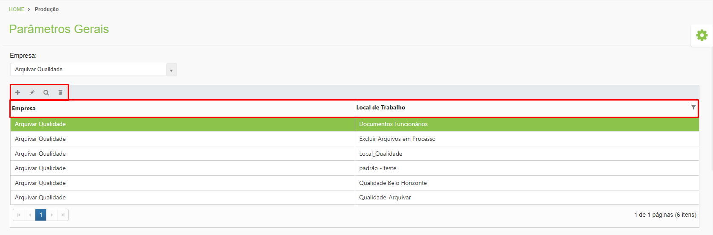
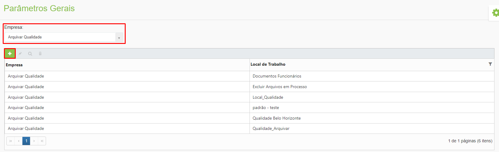
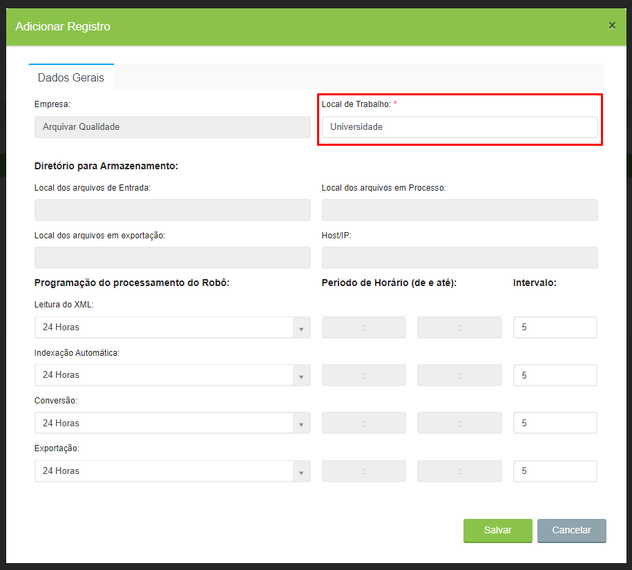
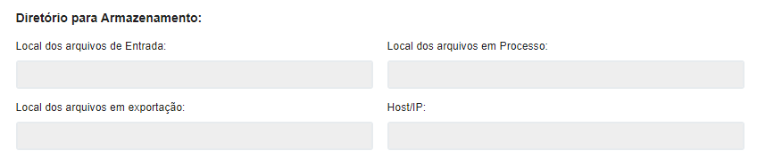
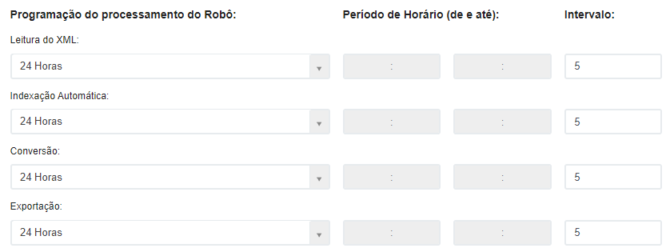
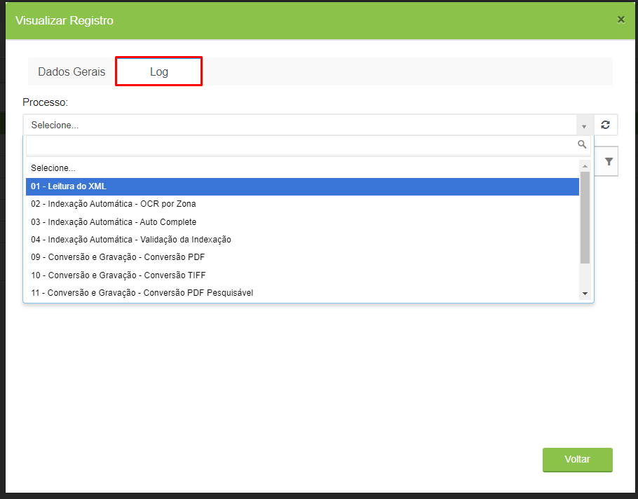
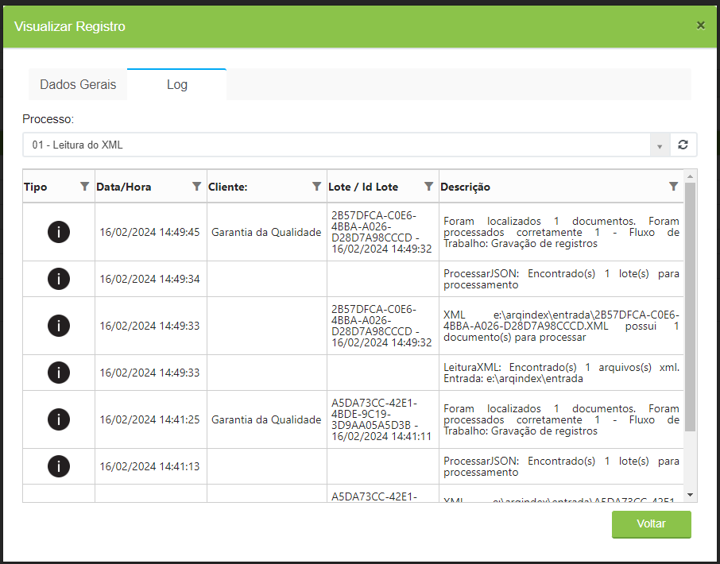

# 🔹 Parâmetros Gerais

No menu Parâmetros Gerais são configurados os locais de trabalho do servidor para o cliente, ou seja, os locais de armazenamento dos arquivos do cliente no servidor.

## Parâmetros Gerais – Tela inicial 

**Campo Empresa:** Utilizado para selecionar o cliente ou a unidade Arquivar relacionada ao cliente.

**Ícone Adicionar:** Utilizado para configurar um novo local de trabalho.

**Ícone Editar:** Utilizado para editar um local de trabalho já existente.

**Ícone Visualizar:** Utilizado para visualizar os detalhes da configuração do local de trabalho selecionado.

**Ícone Excluir:** Utilizado para excluir o local de trabalho selecionado.

**Coluna Empresa:** Mostra o cliente ou unidade Arquivar selecionado.

**Coluna Local de Trabalho:** Mostra o nome dado ao local de trabalho.

<figure><figcaption>
Clique para ampliar a imagem.
</figcaption></figure>

***

## Configuração do local de trabalho 

Para iniciar a configuração de um local de trabalho, selecione a "Empresa" e clique no ícone "Adicionar".

<figure><figcaption>
Clique para ampliar a imagem.
</figcaption></figure>

### Aba Dados Gerais 

Na tela “Adicionar Registro”, informe um nome para o local de trabalho que está sendo configurado.

<figure><figcaption>
Clique para ampliar a imagem.
</figcaption></figure>

Ao longo do processo de indexação um arquivo de documento fica hospedado em diferentes locais do servidor, chamados de “Diretório para Armazenamento”.

**Local dos arquivos de Entrada:** Quando um documento é digitalizado ele gera dois arquivos: um XML e um PDF (imagem), que ficam hospedados nesse local. Quando o robô do ArqIndex inicia o processo de leitura dos arquivos XML e verifica se todas as informações estão corretas.

**Local dos arquivos em Processo:** Local para onde os arquivos são enviados após a leitura inicial do XML pelo robô. Os arquivos dessa pasta ficam em uma fila de trabalho aguardando que sejam indexados.

**Local dos arquivos em Exportação:** Local em que os arquivos ficam hospedados quando já foram indexados e estão prontos para serem exportados para o ArqGED. Quando a exportação é executada, os documentos são gravados na base de dados do sistema e podem ser consultados por meio da Localização Simples, Localização Avançada ou tela Explorar.

**Host/IP:** Endereço da máquina onde o robô do ArqIndex está instalado.

Esses campos ficam desabilitados nessa tela porque a sua configuração deve ser feita quando o aplicativo (robô) for instalado. As configurações feitas durante a[ instalação do aplicativo ArqIndex](aplicativo-arqindex.md#instalacao-do-aplicativo-arqindex) são espelhadas nessa tela.

<figure><figcaption>
Clique para ampliar a imagem.
</figcaption></figure>

Em “Programação do processamento do Robô” é definida a periodicidade da leitura dos arquivos XML, da indexação automática, da conversão e da exportação dos arquivos do cliente, que são as rotinas do processo de indexação de um documento executadas pelo próprio sistema.

Esses campos definem a periodicidade em que cada um dos processos deve ocorrer, que pode ser durante 24 horas ou durante um horário pré-definido. Os campos “Intervalo” devem ser preenchidos com os minutos de intervalo de execução de cada processo, que por padrão é de 5 minutos.


<mark style="color:blue;">**EXEMPLO:**</mark> <mark style="color:blue;"></mark><mark style="color:blue;">É possível que o usuário queira definir que os processos do robô sejam executados em um horário em que não há concorrência no uso da máquina. Neste caso, pode ser definido, por exemplo, o horário pré-definido 17:00 às 08:00.</mark>


<figure><figcaption></figcaption></figure>

***

### Aba Log 

Depois de configurado um local de trabalho, clicando no ícone “Visualizar” é exibida a aba Log, em que são apresentados os logs do robô de processamento, ou seja, as informações de todas as movimentações dos processos que foram realizados nos arquivos escaneados e indexados.

No campo “Processo” selecione a etapa do fluxo de trabalho da qual deseja visualizar os logs executados.

<figure><figcaption>
Clique para ampliar a imagem.
</figcaption></figure>

**Coluna Tipo:** Nesta coluna é apresentado o ícone que representa o tipo de log, que pode ser de informação ou de erro.

**Coluna Data/Hora:** Apresenta as informações de data e hora de quando a ação apresentada foi executada pelo robô do ArqIndex.

**Coluna Cliente:** Apresenta o nome do cliente selecionado.

**Coluna Lote/Id Lote:** Apresenta o Id do lote, quando selecionada a etapa de “Leitura do XML” no campo “Processo”.

**Coluna Descrição:** Apresenta informações do log ou os erros encontrados no processamento do arquivo, se houverem.

<figure><figcaption>
Clique para ampliar a imagem.
</figcaption></figure>
