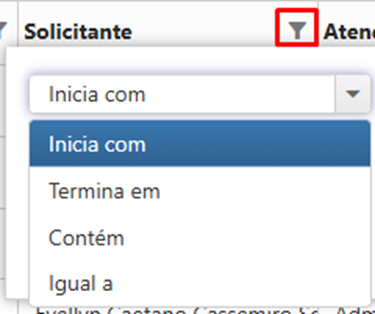

# 🔹 Consulta

Nesta tela são exibidas as solicitações do cliente feitas pelo menu Solicitações > Consulta. Toda a reserva transformada em **Pedido**, fica disponível para atendimento neste local, seja para atendimento realizado pela Unidade Arquivar (Guarda Terceirizada) ou pelo CEDOC do cliente (Guarda Interna).

<figure><figcaption>
Clique na imagem para ampliar.
</figcaption></figure>


<mark style="color:blue;">O painel de atendimento é único e exibe todos os tipos de pedidos realizados no ArqGED:</mark>

* <mark style="color:blue;">Documento original</mark>
* <mark style="color:blue;">Documento digitalizado</mark>
* <mark style="color:blue;">Documento cópia</mark>
* <mark style="color:blue;">Caixa</mark>
* <mark style="color:blue;">Subcaixa</mark>


Os campos exibidos no cabeçalho da página são campos disponíveis para “pesquisa” de pedidos.

<figure><figcaption>
Clique na imagem para ampliar.
</figcaption></figure>

**Prioridade:** Exibe para seleção as opções de atendimento disponíveis, geralmente são utilizadas as opções de consulta "normal e urgente".

**Caixa ou Subcaixa:** Campo disponível para inserir o número da caixa ou subcaixa que deseja consultar o pedido.

**Código Documento:** Campo disponível para consultar os pedidos por código do registro.

**Código Consulta:** Permite a localização do pedido pelo número gerado no atendimento da solicitação.

**Tipo de Guarda:** Exibe as opções de guarda sendo elas guarda terceirizada ou guarda interna. Por padrão este campo já aparece preenchido conforme o tipo de usuário logado.

**Empresa:** Quando o usuário logado for de cliente ou CEDOC, será apresentada apenas a empresa correspondente.

**Data Início / Data Fim:** Permite a busca de todas as solicitações abertas em determinado período.

**Pesquisar:** Ao clicar neste botão, é realizada a busca dos pedidos conforme dados informados para busca.

<figure><figcaption>
Clique na imagem para ampliar.
</figcaption></figure>

**Editar:** Permite a edição do pedido, selecione o pedido e clique em editar.

**Visualizar:** Permite a visualização do pedido, selecione o pedido e clique em visualizar.

**Distribuir:** O ícone é habilitado na tela de atendimento a consulta sempre que +1 pedido com status “Em Triagem” estiver selecionado no GRID.&#x20;

Ao pressionar este ícone a aplicação abre uma modal com os campos “Atendente Responsável” e “Destino”. &#x20;

<figure><figcaption>
Clique na imagem para ampliar.
</figcaption></figure>

Desta forma o Gerente do atendimento pode realizar a definição do atendente responsável e do destino das solicitações selecionadas em lote.&#x20;

Não é obrigatório informar os dois campos, ele pode informar somente um campo, desta forma, se for selecionado novamente um universo, e neste pelo menos 1 pedido já tiver a informação de “Atendente Responsável”, estará habilitado somente o campo “Destino” e vice e versa.&#x20;

<figure><figcaption>
Clique na imagem para ampliar.
</figcaption></figure>

**Exportar:** Permite gerar um arquivo .CSV considerando:

* Informações do Pedido
* Informações dos Itens
* Informações dos Atendimento

O relatório de “Informações dos Atendimentos” é muito utilizado para validação do faturamento, pois, nele são consideradas as informações utilizadas durante o processo.

<figure><figcaption>
Clique na imagem para ampliar.
</figcaption></figure>

**Coluna Tipo:** Exibe o ícone que corresponde ao tipo de volume solicitado.

<figure><figcaption>
Clique na imagem para ampliar.
</figcaption></figure>

**Coluna Pedido:** Exibe o número de pedido gerado no momento do envio da solicitação de consulta.

**Coluna Cliente:** Exibe o nome do cliente de cada um dos pedidos.

**Coluna Solicitante:** Exibe o nome do usuário que realizou a solicitação no sistema.

**Coluna Atendente:** Exibe o nome do colaborador responsável pelo atendimento da solicitação.

**Coluna Data Envio:** Exibe a data/hora em que o pedido foi efetivado no sistema pelo solicitante.

**Coluna Ordem:** Por padrão o campo “Ordem” sempre vem com o número “10”, e o usuário terá a possibilidade de mudar a ordem do pedido, diminuindo este número e então este pedido ficará na frente dos demais independente do seu SLA. Seria uma forma do Gerente poder priorizar um pedido por questões críticas.

Por padrão, os pedidos são ordenados com a seguinte regra:&#x20;

1. Ordenados pelo campo “Ordem”&#x20;
2. Ordenados pelo “Status”&#x20;
3. Ordenados pelo “SLA” (o mais antigo primeiro)&#x20;

**Coluna Data SLA:** Exibe a data/hora ou período limite para conclusão do atendimento da solicitação.

**Coluna Data Previsão:** Exibe a data prevista para fechamento do atendimento no sistema.

**Coluna Data Fechado:** Exibe a data de fechamento (conclusão do atendimento) do pedido no sistema.

**Coluna Status:** Exibe em qual fase do fluxo de consulta o pedido está no momento.

**Coluna Destino:** Exibe o destino do item solicitado após busca no local de acondicionamento.

&#x20;Além dos filtros disponíveis no cabeçalho da tela, existe a possibilidade de aplicação de filtro nas colunas.

<figure><figcaption>
Clique na imagem para ampliar.
</figcaption></figure>

&#x20;Ao utilizar o filtro das colunas do Painel de Atendimento, fique atento aos comandos disponíveis para busca:

<figure><figcaption>
Clique na imagem para ampliar.
</figcaption></figure>

O ideal, quando o usuário não tiver certeza de como foi escrito o texto que busca, é informar que o filtro deverá considerar tudo que “**Contém**” o texto e informar no filtro parte da informação que deseja buscar.

<figure><figcaption>
Clique na imagem para ampliar.
</figcaption></figure>


<mark style="color:blue;">O usuário</mark> <mark style="color:blue;"></mark><mark style="color:blue;">**solicitante**</mark> <mark style="color:blue;"></mark><mark style="color:blue;">poderá acessar o painel de atendimento para</mark> <mark style="color:blue;"></mark><mark style="color:blue;">**visualizar**</mark> <mark style="color:blue;"></mark><mark style="color:blue;">o andamento da sua solicitação, consultar seu pedido ou exportar dados do pedido em .CSV, porém, não é permitido ao solicitante nenhuma interação com o atendimento da demanda. Apenas o atendente da Unidade Arquivar ou do CEDOC do cliente, poderá prosseguir com o atendimento do pedido no sistema. Para o usuário solicitante não é habilitada a opção de "Editar" o pedido.</mark>


***

## Atendimento de um Pedido de Documento

No Painel de Atendimento, selecione o pedido que será trabalhado e clique em editar.

<figure><figcaption>
Clique na imagem para ampliar.
</figcaption></figure>

A tela de atendimento é dividida em duas abas:

### Aba Dados Gerais

A aba Dados Gerais exibe vários campos inativos para preenchimento, trata-se de informações que foram inseridas ao longo do processo de reserva e abertura do pedido no sistema.


<mark style="color:blue;">Tanto para o pedido de documento quanto para o pedido de caixa/subcaixa, a aba “Dados Gerais” apresenta a mesma necessidade de preenchimento para sequência no atendimento do pedido no sistema.</mark>


<figure><figcaption>
Clique na imagem para ampliar.
</figcaption></figure>

Quando no fluxo de atendimento do cliente tiver definida a etapa de “**Aprovação**”, o pedido só poderá entrar em atendimento após o responsável imediato no cliente efetuar a aprovação da solicitação, ou seja, quando ele aprovar o pedido.&#x20;

Essa medida é geralmente utilizada para evitar o **acesso indevido**, de pessoas não autorizadas à determinado acervo.&#x20;


<mark style="color:red;">A aprovação considera sempre o volume total (documento ou caixa/subcaixa) solicitado no pedido, então se um pedido possui 10 documentos a aprovação autoriza o atendimento dos 10 documentos. Caso o responsável pela aprovação identifique no pedido algum item que não deve ser autorizado, todo o pedido deve ser cancelado e o processo realizado novamente pelo solicitante, desconsiderando o item não autorizado pelo Gestor.</mark>


Para “Aprovar” ou “Cancelar” o pedido, o responsável deverá acessar a tela Solicitação > Atendimento > Consulta, identificar e abrir o pedido, clicar em “Salvar” e depois em “Processar” para aprovar ou no caso de cancelamento, clicar em "Salvar" e depois em “Cancelar Pedido”.

<figure><figcaption>
Clique na imagem para ampliar.
</figcaption></figure>

Aprovado o pedido, o status é alterado e uma nova ação é registrada.

<figure><figcaption>
Clique na imagem para ampliar.
</figcaption></figure>

Feita a aprovação, o status do pedido é alterado para "Triagem" e o pedido fica disponível para andamento do atendimento,  além de gerar uma nova ação para o atendimento.&#x20;


<mark style="color:blue;">A data e Hora registrada no campo “Ação”, sinaliza a hora que a ação foi gerada no ArqGED e não a hora de efetivação, por exemplo, na imagem a “Aprovação” foi gerada em 09/08/2024, ou seja, o pedido ficou aguardando aprovação a partir desta data. Em 12/11/2024 o pedido foi aprovado e gerada a ação de “Triagem”, ou seja, o pedido teve sua aprovação efetivada no sistema em 12/11/2024.</mark>


Retornando ao atendimento do pedido, agora aprovado, o atendente deverá iniciar com o preenchimento dos campos:

<figure><figcaption>
Clique na imagem para ampliar.
</figcaption></figure>

**Ordem:** Por padrão o campo é exibido preenchido com a informação "10", neste momento o atendente poderá reduzir esta numeração, o que altera a prioridade de atendimento deste pedido no painel de atendimento.

**Status:** Exibe o status do pedido em questão.

**Destino:** Exibe a lista de possibilidades de envio do pedido ao concluir a fase de triagem.

**Atendente:** Selecione neste campo o nome do atendente que irá seguir com o atendimento do pedido no sistema. Identificar o atendente responsável pelo pedido, impede que mais de uma pessoa fique dedicada ao mesmo trabalho/atendimento.

Preenchidos todos os campos, clique salvar para prosseguir. Após salvar, os botões “Cancelar Pedido” e “Guia” são habilitados e para utilização.

<figure><figcaption>
Clique na imagem para ampliar.
</figcaption></figure>

**Cancelar Pedido:** O identificar alguma inconsistência, o atendente pode realizar o cancelamento do pedido. Ao optar por desistir do pedido, será apresentada uma mensagem de confirmação da ação. Ao confirmar o pedido é cancelado e o documento volta a ficar disponível para nova reserva.

**Guia:** Ao clicar neste botão, é aberta a Guia de Busca de Documentos. Esta guia pode ser impressa e entregue ao auxiliar de arquivo para que realize a busca do volume no Arquivo.

#### Guia de Busca de Documentos

<figure><figcaption>
Clique na imagem para amoliar.
</figcaption></figure>

No cabeçalho é exibido:

·         Pedido: Exibe o número do pedido de caixa criado no ArqGED.

Dados do solicitante:

·         Nome do cliente

·         Data/Hora de abertura do pedido

·         Nome do solicitante no ArqGED

·         Telefone do solicitante

<figure><figcaption></figcaption></figure>

Abaixo é exibida:

·         Listagem dos documentos solicitados no pedido com a associação da caixa de guarda onde estão alocados

·         Endereço das caixas

·         Exibe a forma de entrega definida pelo solicitante

·         Exibe o destino, ou seja, para onde os documentos devem ser encaminhados para andamento do atendimento

·         Local para o auxiliar de arquivo sinalizar se a caixa foi localizada no arquivo

<figure><figcaption></figcaption></figure>

Por fim, são exibidos campos que identificam os atores atuantes no atendimento:

·         Atendente Responsável

·         Auxiliar de Arquivo responsável pela consulta

·         Auxiliar de Arquivo responsável pela Devolução

·         Data/Hora da Impressão da guia

<figure><figcaption></figcaption></figure>

Concluído o processo de busca no arquivo, o atendente precisa informar para o sistema que a etapa foi realizada para prosseguir com o atendimento.

Clique “Processar”.
